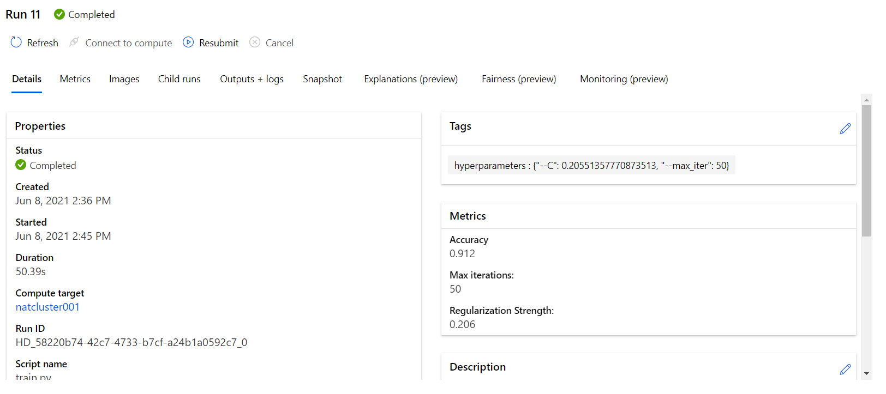
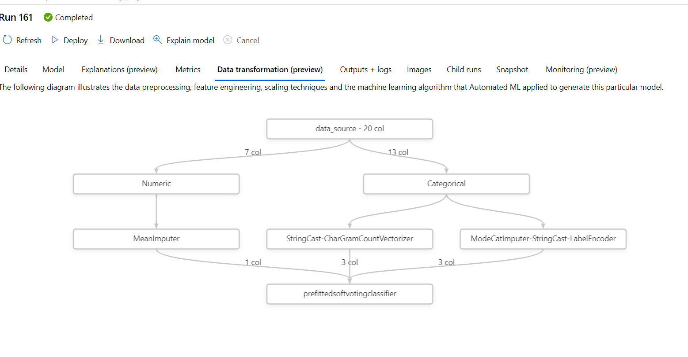
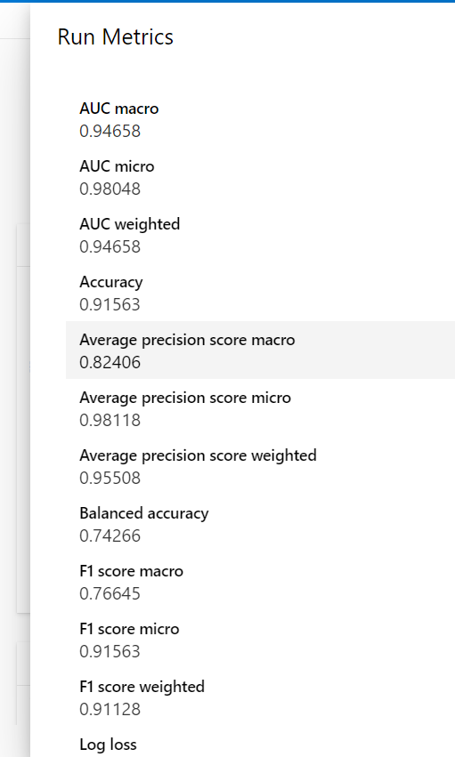
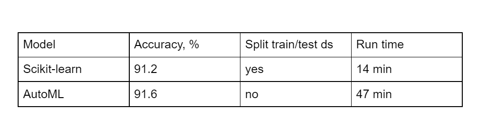

# Optimizing an ML Pipeline in Azure

## Overview
This project is part of the Udacity Azure ML Nanodegree.
In this project, we build and optimize an Azure ML pipeline using the Python SDK and a provided Scikit-learn model.
This model is then compared to an Azure AutoML run.

## Summary
The analysed dataset named “bank-marketing-dataset” contains information about direct marketing campaigns of a Portuguese banking institution, the marketing campaigns were based on phone calls.
The goal of the forecasting is  to predict if the client will subscribe to (yes/no) a term deposit, that  is the typical classification task.  
The best performing model proved to be “Voting Ensemble” with 91.4% of accuracy.

## Scikit-learn Pipeline
The Scikit-learn Pipeline includes several steps:

1. Create dataset from URL
2. Convert dataset to pandas dataframe
3. Clear data (drop NAs)
4. Data transformation
5. Split data in training (66% of data) and test (33%) data sets
6. Applying the  Logistic Regression model, the parameters used into the training script are : 
  a. C (Inverse of regularization strength)
  b. maximum number of iterations to converge
  
  **Parameter sampling**
  
  The Hyperdrive service of Azure allows you to apply the set of parameters to reach the best  model performance.
My choice for C parameter is a set of Uniform values in range [0.1; 1] that guarantees the full coverage of possible values.
I set up the maximum number of iteration as a list of values [50, 75, 100, 125]
The best model has the following parameters:
   C= 0.2055
   maximum number of iterations= 50
   
 **Early stopping policy**
 
 I set the early stopping policy as Bandit Policy with arguments:
 
    a. slack_factor = 0.1
    b. evaluation_interval = 2
 
It means that every 2 iterations the gap between best result and the current result will be measured. If this gap is greater than 10%, the execution will be terminated.
The Bandit Policy permits non-spending cluster resources when the current run is underperforming the best run.
The best classification model has 91.2% of accuracy:

## AutoML

The first steps of AutoML pipeline is very similar to the Scikit-learn pipeline:
1. Create dataset from URL
2. Convert dataset to pandas dataframe
3. Clear data
4. Do not split the data into training and testing dataset
5. Pass cleared data to AutoML process
You can see all of these steps in the following diagram:

The best selected model is Voting Ensemble with 91.6% of accuracy. 
Other best model’s metrics:

## Pipeline comparison
The performance of two pipelines in term of accuracy is very similar:
Here is the comparison table:

As you can see with the AutoML model we gain 0.4 points in accuracy , but the running takes 3 times as long as the Scikit-learn model.
## Future work

Some possible improvement:
1. run AutoML pipeline for a longer time.
2. try maximize another metrics (for example AUC)
3. try to apply other set of parameters to scikit-learn model

## Proof of cluster clean up

